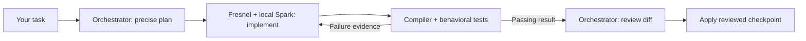

# Fresnel

**Your coding agent plans. A local model implements. You review the result.**

Fresnel lets an orchestrator such as Codex, Cursor, or OpenCode delegate small,
precisely specified coding tasks to Spark on your Mac. It manages the worker's
context, tools, resource budgets, validation, and recovery—not your architecture.

The goal is to spend fewer paid-model tokens on implementation without giving up
review. Net cost savings are still being evaluated; local inference also costs
time, memory, and power.

> **Experimental · Apple Silicon · macOS 14+ · 16 GB+ unified memory**
> The supported worker is Spark-X2.5-4B-MLX-8bit. Model weights are downloaded
> separately during setup. Windows/Linux runtimes and a dedicated Claude Code
> adapter are not yet supported.

## How it works



The orchestrator resolves interfaces, algorithms, edge cases, and acceptance
tests before delegation. We call this a **resolved program IR**: a precise,
language-neutral implementation plan, not another programming language.
Spark implements one bounded component; failed checks drive targeted repairs
within the budget. Passing tests still require a final semantic review.

Fresnel is best suited to small helpers, mechanical edits, and explicit algorithms
with independent tests. It is not a substitute for designing a whole application
or reviewing unfamiliar code.

## Homebrew install

```bash
brew install --yes darkwebber/tap/fresnel
fresnel setup
```

Setup installs the pinned runtime, downloads the model, calibrates initial
budgets, and guides integration with your coding agent. Allow time and disk space
for the model download; setup duration depends on your connection and hardware.

If you already installed Fresnel but haven't finished configuration, run
`fresnel onboard`. Use `fresnel doctor` to check the installation.

## Your first delegation

### 1. Connect your orchestrator

Choose the command for your coding agent. Replace `/absolute/project` with your
project directory:

```bash
fresnel integrations install codex
fresnel integrations install cursor --project /absolute/project
fresnel integrations install opencode --project /absolute/project
```

These install the shared planning, delegation, and review instructions. For other
tools, use the [generic CLI or MCP integration](docs/workflows.md). MCP hosts launch
`fresnel mcp`; that process waits for protocol messages, not typed chat.

### 2. Ask for a small, testable change

For example, give your orchestrator this request:

> Use Fresnel to add a Python `clamp(value, lower, upper)` helper. Return the
> nearest bound for out-of-range values; reject inverted bounds. Define the
> interface and independent tests, delegate implementation, then show me the diff,
> validation results, retries, and token usage before applying it.

Your existing orchestrator can write the plan directly—no additional coordinator
API is required. The optional `fresnel plan` command uses a separately configured
coordinator API. See the [example plan](examples/smoke-plan.json) and
[orchestrator handoff guide](integrations/fresnel/references/resolved-ir.md).

### 3. Review, then apply

The underlying CLI workflow is below. Replace the uppercase placeholders with
your paths and the run ID returned by Fresnel; keep the report outside the project.

```bash
fresnel run --repo REPO --plan PLAN.json --output REPORT.json
fresnel review REPORT.json
# Only after reviewing a passing result:
fresnel run --resume RUN_ID --apply
```

Implementation happens in a separate durable workspace. Resuming the reviewed run
applies its checkpoint instead of asking the model to generate a new version.

## Just ask a question

```bash
fresnel ask "Explain the difference between a PySpark repartition and coalesce"
```

Answers stream by default. Completed interactive answers are rendered with
Glow/Termtex when available and copied to your clipboard. Use `--no-copy` to opt
out, `--render plain` for plain rendering, or `--json` for machine-readable output.

`ask` returns text; it does **not** run behavioral tests or apply project edits.
Use `run` for validated implementation. Continuation is bounded and can still
fail on truncated code; incomplete answers are reported and not automatically
copied. [Sessions, output budgets, and recovery →](docs/workflows.md#questions-versus-edits)

## Stay in control

| Need | Command |
|---|---|
| Follow a run | `fresnel status --run RUN_ID --follow` |
| Resume interrupted work | `fresnel run --resume RUN_ID` |
| Cancel a run | `fresnel cancel RUN_ID` |
| Inspect its stored context | `fresnel memory inspect --run RUN_ID` |
| Select a lighter profile | `fresnel config profile eco` |
| Adjust generation sampling | `fresnel config sampling --temperature 0.25 --top-p 0.9` |
| Diagnose setup | `fresnel doctor` |

CLI progress reports phases, attempts, validation, and elapsed time; ETA depends
on available evidence. Orchestrators can request `--progress json` or use MCP
notifications. If a host hides progress, the status command and run report retain it.

Working state and evidence live outside the model's context. Each attempt receives
a bounded selection rather than the whole conversation. Personalization inference
is opt-in. Local worker inference does not make every workflow offline: optional
coordinator APIs and authorized Exa research use external services. Never put
secrets in plans or prompts. [Memory and privacy details →](docs/memory.md)

## Current limitations

- **Reliability:** small components and independent tests matter. Neither clean
  Markdown nor a successful compile proves that an implementation is correct.
- **Calibration:** current output-allowance probes use short responses. Profiles
  are starting budgets, not proof of sustained long-output capacity.
- **Efficiency:** early resolved-IR trials are small. Broad quality, total cost,
  and energy improvements have not been established.
- **Learning:** rule-promotion gates evaluate submitted evidence; independently
  reproducible learning evaluations remain open work. Multi-model routing is
  shadow-only, not active worker selection.

See [evaluation methods and known gaps](docs/evaluation.md) for measurements and
limitations, and [release notes](https://github.com/darkwebber/fresnel/releases)
for version-specific changes.

## Choose your depth

| Guide | What you'll find |
|---|---|
| [Workflows and troubleshooting](docs/workflows.md) | Integration, plan/run/review/apply, sessions, recovery, common failures |
| [Architecture](docs/architecture.md) | Responsibilities, contracts, execution lifecycle, source map |
| [Memory, preferences, and learning](docs/memory.md) | Context selection, retention, consent, inspection, learning boundaries |
| [Evaluation and calibration](docs/evaluation.md) | Reproducible measurements, existing evidence, resource caveats |
| [Contributor guide](CONTRIBUTORS.md) | Model-free development, tests, engineering expectations, starter issues |

## Contribute

Help make local delegation more reliable, measurable, and pleasant to use.
Contributions in testing, documentation, accessibility, integrations, and performance
research are welcome—you don't need to download a model to get started.

Start with the [contributor guide](CONTRIBUTORS.md) or browse
[good first issues](https://github.com/darkwebber/fresnel/labels/good%20first%20issue).

Licensed under [Apache 2.0](LICENSE).
