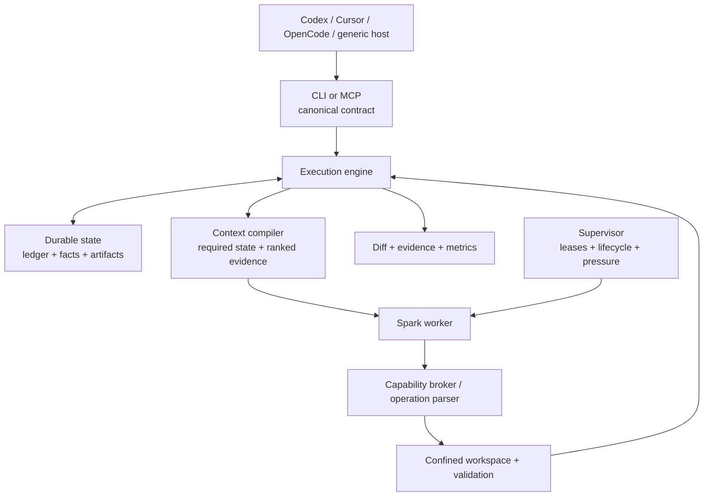
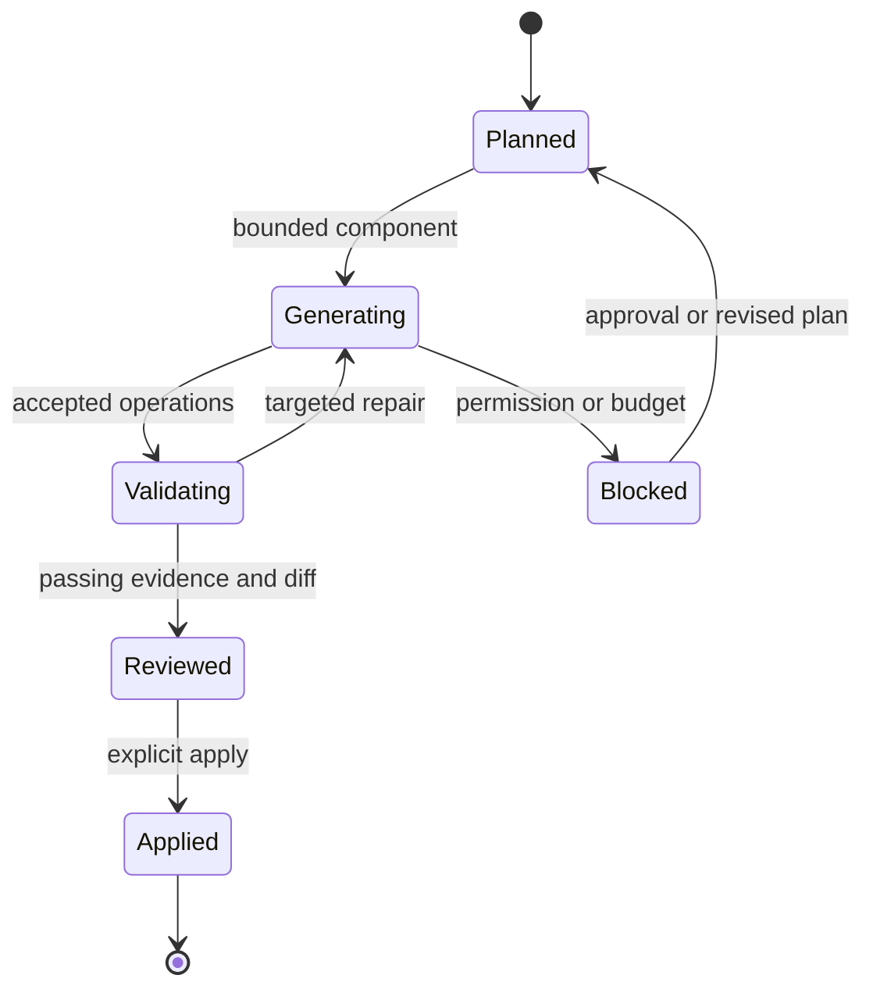

# Architecture and orchestration

[Documentation home](../README.md#choose-your-depth)

## The division of responsibility

| Orchestrator | Harness | Local worker |
|---|---|---|
| Goal, architecture and decomposition | Validate plans and target boundaries | Implement one bounded component |
| Types, algorithms and invariants | Select context; broker tools/evidence | Request specific missing information |
| Independent acceptance tests | Execute gates; persist checkpoints | Repair a focused diagnostic |
| Approvals and final review | Record budgets, failures and progress | Return structured output or blocker |

The engine selects evidence rather than replaying every transcript. The broker
resolves requests; it does not give the model unrestricted system access. Supervisor
leases allow healthy worker reuse instead of loading one model per component.

## Resolved program IR

Resolve signatures, data/state layout, ordered operations, exact branch predicates,
invalid-input handling and verified API contracts before generation. Encode them in
protocol 1.1 `implementation`, `interfaces` and `invariants`. This is language-neutral
implementation guidance, not finished source for the worker to echo.

Example: validate interval pairs; sort a copy; append if start > last end; otherwise
extend with max(last end, end); return tuples. Independent tests cover empty, nested,
touching, disjoint and invalid inputs. The orchestrator still owns correctness.

Read [the IR handoff](../integrations/fresnel/references/resolved-ir.md) and
[protocol reference](../integrations/fresnel/references/protocol.md).
`fresnel contract --format json` exposes the canonical schema/workflow.

## Execution and repair

This diagram is conceptual, not literal database status names. Resume from verified
checkpoints; stale hashes require replanning/review. After two same-cause failures,
separate model, parser, toolchain and specification failures before spending more
calls. Don't ask the worker to rewrite code to fix a broken compiler installation.

## Boundaries and source map

| Concern | Source under `src/fresnel/` unless noted |
|---|---|
| Public contract and adapters | `protocol.py`, `integrations.py`, `cli.py`, `mcp_server.py` |
| Execution and operations | `engine.py`, `worker.py`, `workspace.py` |
| Tools and confinement | `capabilities.py`, `references.py`, `sandbox.py` |
| Context and state | `context.py`, `budget.py`, `memory.py`, `store.py` |
| Lifecycle and display | `supervisor.py`, `progress.py`, `terminal.py`, `native/` at repo root |

Host portability is not runtime portability: multiple hosts work through CLI/MCP,
but Windows/Linux production backends are not supported yet. Current non-macOS
sandbox fallback is a gap, not a security guarantee. Ports must establish isolation.

Policy checks and OS confinement are separate protections. Model output and retrieved
documents remain untrusted. Exa requires configuration and component authorization;
external writes and expanded scope are not normal read-only inspection.

Inference is local in the production setup. Artifact downloads, explicitly configured
coordinator APIs and authorized research involve external traffic. “Local-first” is
not a promise that every optional workflow is offline.
