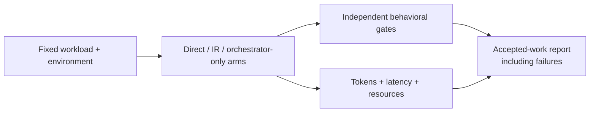

# Evaluation, calibration and resources

[Documentation home](../README.md#choose-your-depth)

## Three different questions

| Activity | Question | Not evidence of |
|---|---|---|
| Calibration | What budgets appear practical here? | Code quality or sustained decode capacity |
| Quality evaluation | Does code pass independent gates? | Net savings without planner/reviewer measurement |
| Lifecycle profiling | What happens during load/cache/idle/pressure? | Energy savings without power measurement |



## Commands and limitations

```bash
fresnel benchmark --quick --json
fresnel benchmark --json
fresnel tune --json
fresnel config profile eco
```

These commands perform real work. Hardware probes use temperature 0 for repeatability;
normal generation uses profile sampling (balanced currently defaults to 0.15).
`tune` evaluates sampling separately. See `config sampling --help` for overrides.

Current context probes use approximate sizes: inspect actual `prompt_tokens`.
Current `output_ceiling` probes request a large allowance but send “Health check only.”
**A two-token response does not validate sustained 4,096-token decoding or peak KV
memory.** Treat profiles as starting budgets, not guaranteed capacity. Null peak
memory means unavailable; endpoint wall time is not decode-only latency.

Separate cold/warm/cache runs and disclose background load, AC/battery and thermal
state. A repeated-prompt speedup is not a general inference speedup.

## Existing IR feasibility trial

See [benchmark assets](../benchmarks/README.md) for runnable experiments versus
historical results and plans with missing external fixtures.

Spark 4B 8-bit, temperature 0.15, 768 output tokens/call, two stdlib Python tasks,
identical behavioral gates, at most one repair per task:

| Arm | First pass | After repair | Calls | Input / output tokens | Worker seconds |
|---|---:|---:|---:|---:|---:|
| Direct instructions | 0/2 | 0/2 | 4 | 1,032 / 868 | 34.103 |
| Resolved IR | 2/2 | 2/2 | 2 | 414 / 540 | 23.034 |

This tiny trial supports further investigation, not a general success rate. Planner
and reviewer cost/energy were unmetered; order/cache effects uncontrolled. Forced
128/256-token continuation tests still exposed malformed suffixes/premature stops.
See [release evidence](../packaging/RELEASE_NOTES_0.5.1.md) and
[the opt-in reproducer](../scripts/evaluate-resolved-ir.py).

## Reporting a useful experiment

Record model/runtime revisions, OS/chip/RAM, budgets, sampling, cache policy, power
source, workload revision, timeout and acceptance gates. Repeat/order-balance trials
and retain every failure. Distinguish planning, generation, capabilities, repair,
validation and review time. Keep outputs outside implementation repositories.

Report first-pass/post-repair accepted work alongside resource use. Coordinator cost
requires actual usage and pricing; missing usage is not zero. Local tokens consume
time/resources without an API bill. Cost per accepted component is undefined when
none pass; never hide failed calls or treat safe rejection as successful implementation.

Layer streaming/offload research must distinguish weights, KV/cache and runtime
overhead; measure SSD I/O, prefill, decode, resident/peak memory, swap and available
energy data. Lower residency can mean worse latency/power. Publish negative results.

Existing work: [IR evaluation #10](https://github.com/darkwebber/fresnel/issues/10),
[offload feasibility #9](https://github.com/darkwebber/fresnel/issues/9),
[recovery testing #12](https://github.com/darkwebber/fresnel/issues/12).

New contribution tracks: [sustained-decode calibration #14](https://github.com/darkwebber/fresnel/issues/14)
and [versioned measurements/reports #18](https://github.com/darkwebber/fresnel/issues/18).
