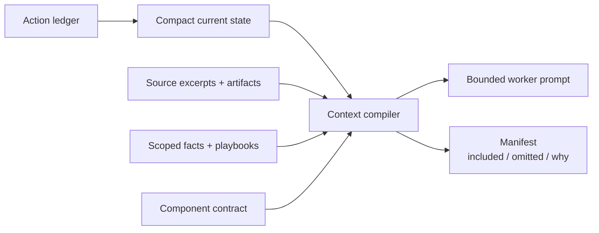
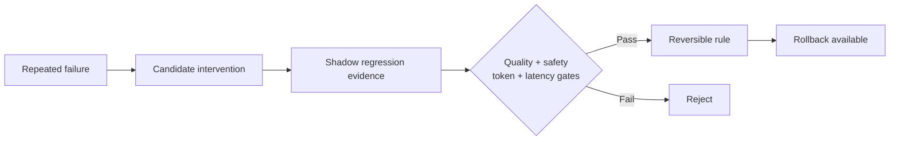

# Memory, preferences and learning

[Documentation home](../README.md#choose-your-depth)

**Context is a workbench, not the database.** Exact evidence and durable state live
outside the prompt; each attempt receives selected material.



| Layer | Purpose | Important boundary |
|---|---|---|
| Working state | Goal/current/done/next derived from events | Summaries are weaker evidence than tests/source |
| Ledger | Actions, failures, validations, recovery | Resume must not duplicate side effects |
| Facts | Explicit or opted-in inferred conventions | Scope and provenance require testing |
| Playbooks | Reversible instruction/retrieval rules | Promotion needs trustworthy evidence |
| Artifacts | Exact logs/output and content-addressed blobs | Redaction cannot identify every secret format |

Required context must fit or compilation fails. Optional fresh evidence is ranked
by priority per estimated token. The current estimate is character-based, not an
exact tokenizer count. Manifests explain selections/omissions. Retrieval quality and
usefulness feedback remain evaluation targets, not proven optimal behavior.

## Inspect and control

```bash
fresnel memory status --repo /absolute/project
fresnel memory inspect --run RUN_ID
fresnel memory replay RUN_ID
fresnel memory profile --help
fresnel memory gc --dry-run
```

Subcommands `remember`, `observe`, `explain`, `correct`, `forget-fact`, `export` and
`personalization` expose fact controls; consult their `--help` for arguments.
Invalidating a fact is not secure deletion of every historical copy. Review exports
before sharing. Don't publish private state databases or workspaces.

Unpinned raw artifacts are eligible for cleanup after 30 days. Fact supersession,
ledger history and workspace retention are distinct lifecycles. Use GC dry-run first.

## Personalization

Inference is disabled unless opted in. Explicit facts can be stored immediately.
The observation mechanism promotes after three matching observations across two runs;
this does not imply a continuously running autonomous user profiler. Project scope
and user-global scope are distinct. File-backed facts invalidate when source hashes
change. Pattern-based credential rejection cannot catch all sensitive business data.

Preference conflicts, correction, opt-out and forgetting need stronger end-to-end
tests. An inferred convention must not override an explicit task or permission.

## Learning is not autonomous self-rewriting



`fresnel learn` proposes interventions from repeated signatures. Evaluation accepts
submitted evidence for prompt/retrieval/playbook changes; that alone does not prove
an independent regression campaign ran. Current gates check passing trigger cases,
no new failures, unchanged permission risk, and reported output-token/latency increases
no greater than 15%. Provenance and held-out evidence are important open work.
Code, policy and sandbox changes remain reviewed work. See `fresnel learn --help`.

## Help improve this

- [Scoped retrieval and compaction evaluation #15](https://github.com/darkwebber/fresnel/issues/15)
- [Preference precedence, consent and forgetting #16](https://github.com/darkwebber/fresnel/issues/16)
- [Verifiable learning evidence #17](https://github.com/darkwebber/fresnel/issues/17)
